## Getting Started

The application aims to solve the challenges and problems facing traditional restaurant ordering processes such as long waits, order errors, and unclear working hours. The application allows customers to easily browse the menu, find out the restaurant’s working hours, add products to the order cart, locate the order, add notes, and complete payments securely. The app also provides opportunities for customers to select their favorite products. The app uses Firebase technology to ensure data is updated in real time, provides accurate information about products, prices and availability, and provides flexible and attractive interfaces using the Flutter framework. This application seeks to improve customer experience and increase restaurant revenues by adopting technology to achieve smooth and satisfied interaction between customers and restaurants.
## Demo

## ScreenShots
Home-screen
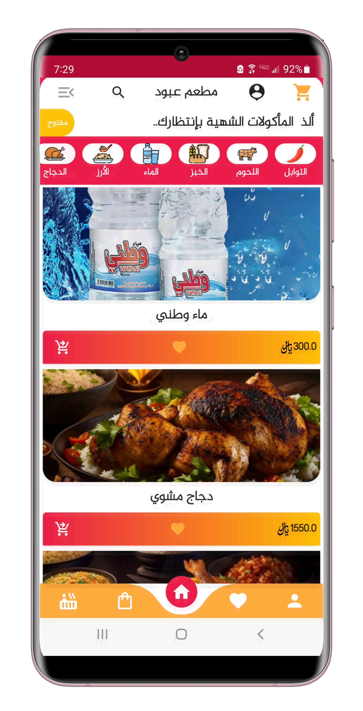
cart-screen
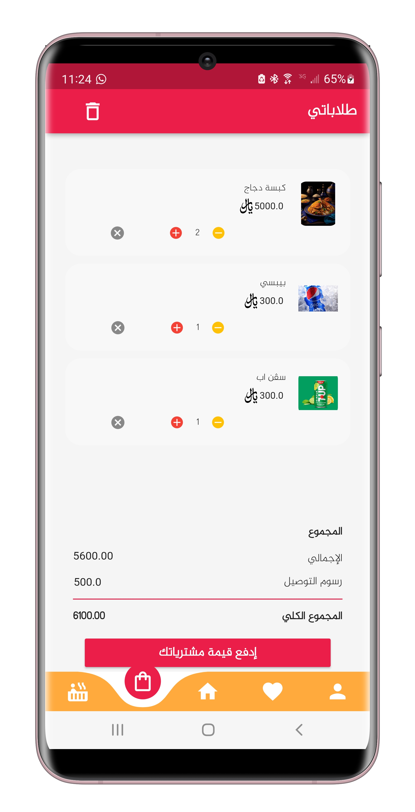
Categories-screen
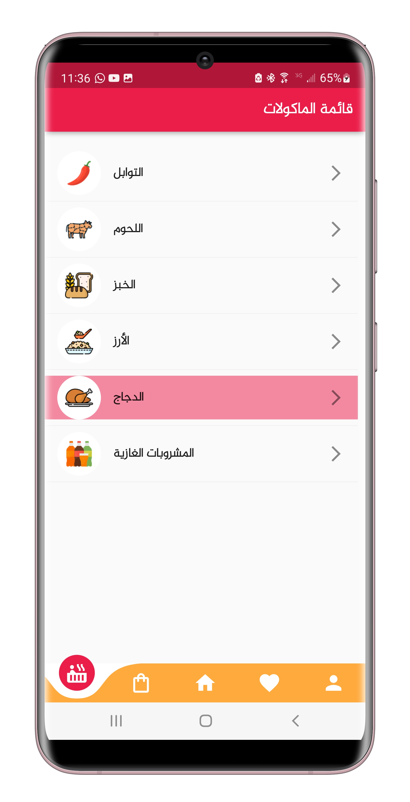
Checkout-screen
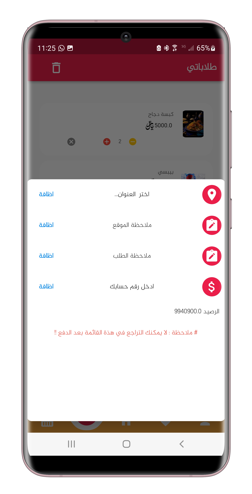
Email-verification-screen
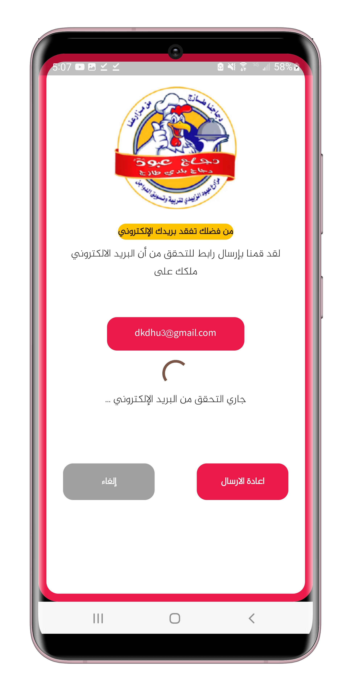
Change-password-screen
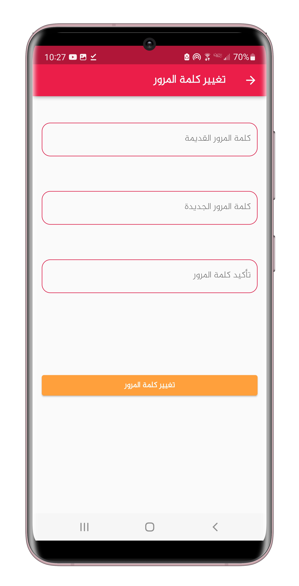
Change-city-screen

Address-screen
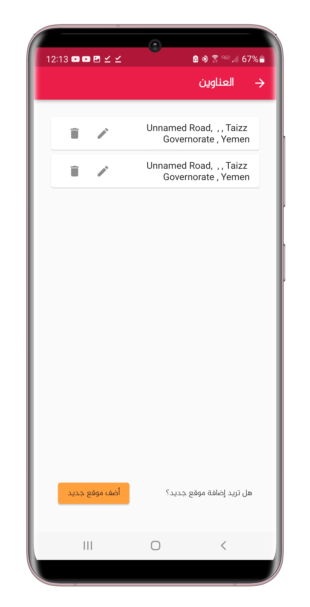
Favorite-Products-screen
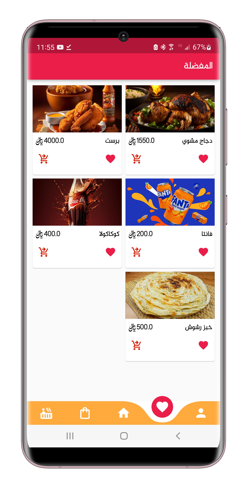
Account-management-screen
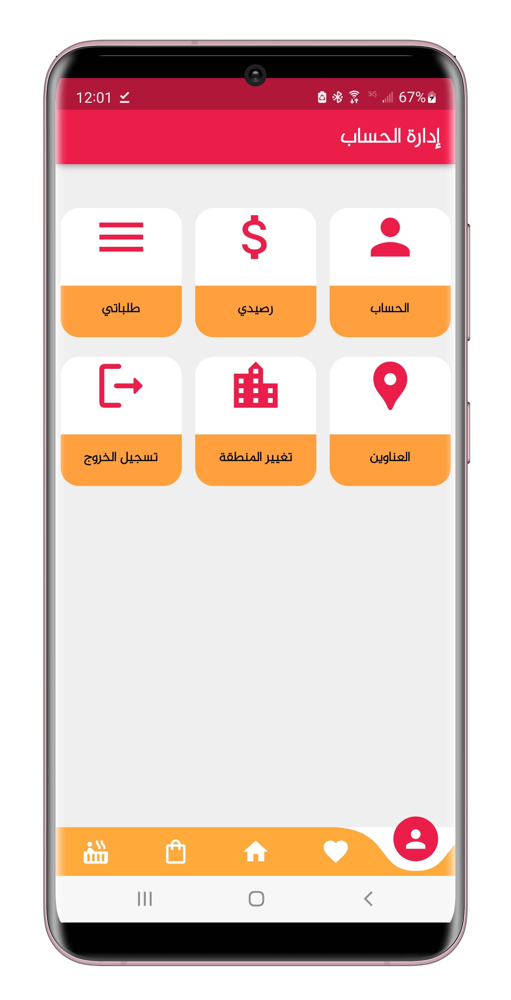
Login-screen
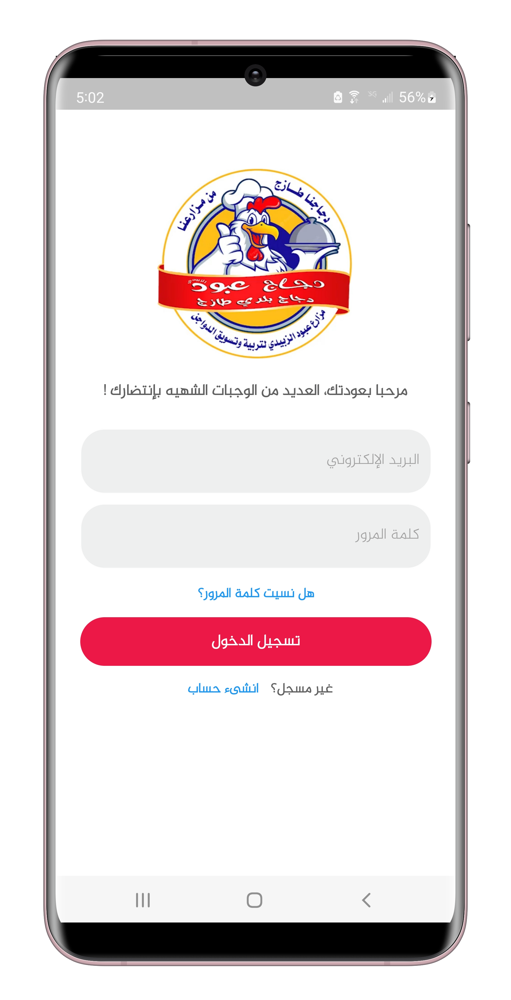
Product-description-screen
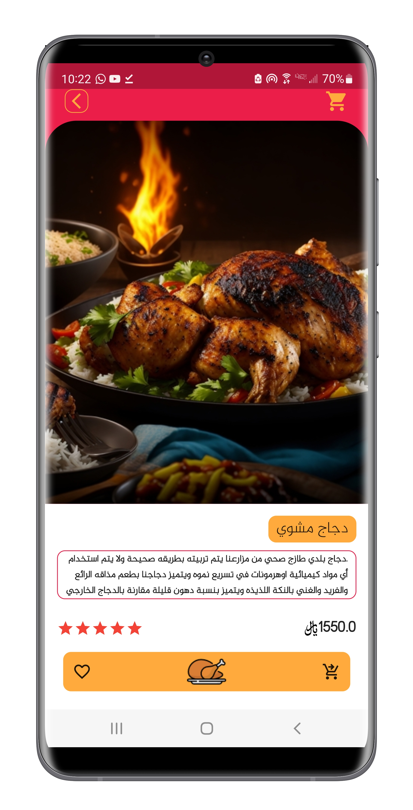
Profile-screen
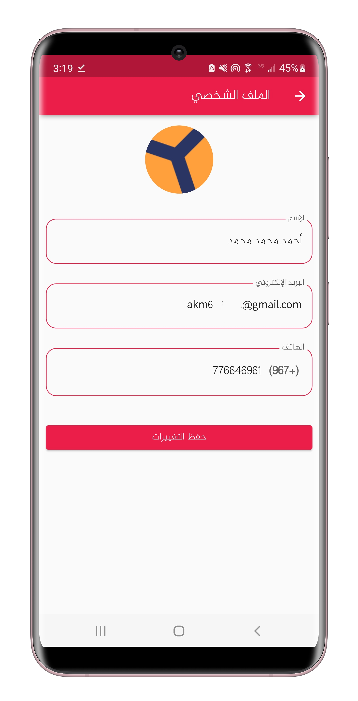
Search-screen
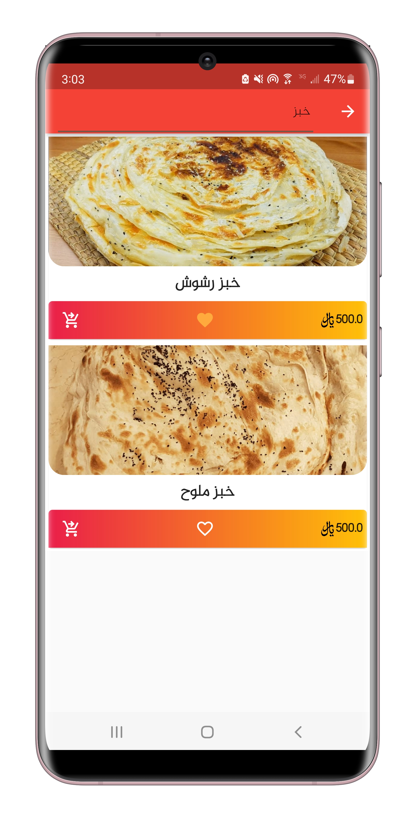
SignUp-screen
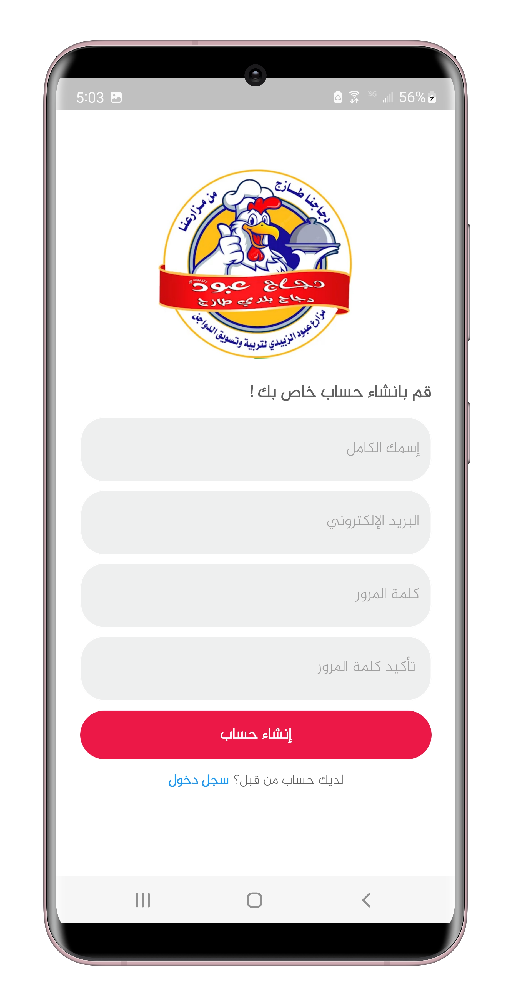
My-orders-screen
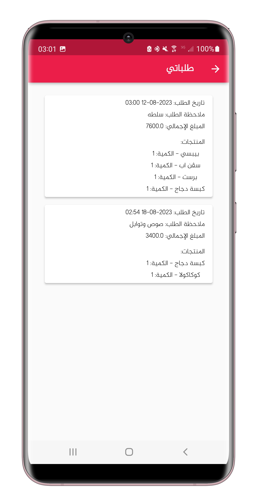
Palance-screen
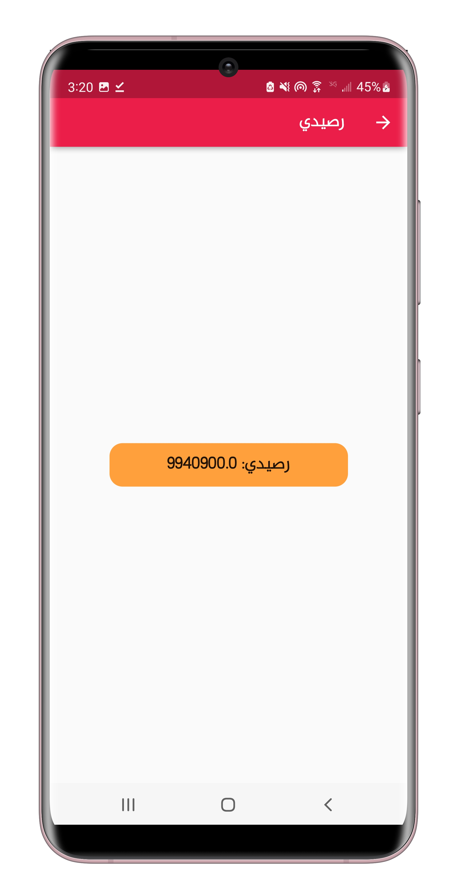
Sub-category-screen
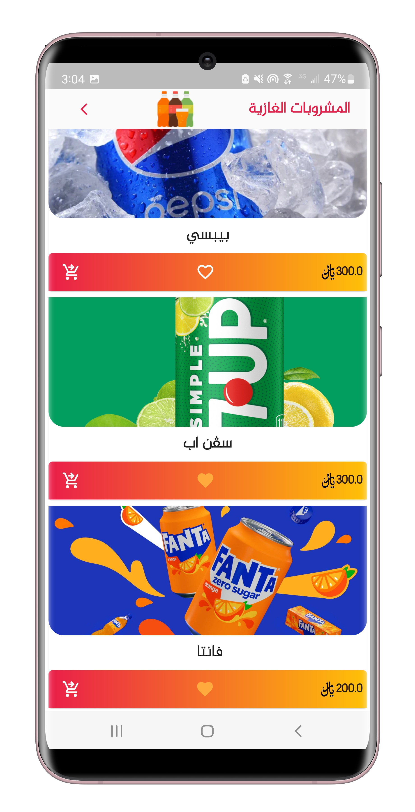
